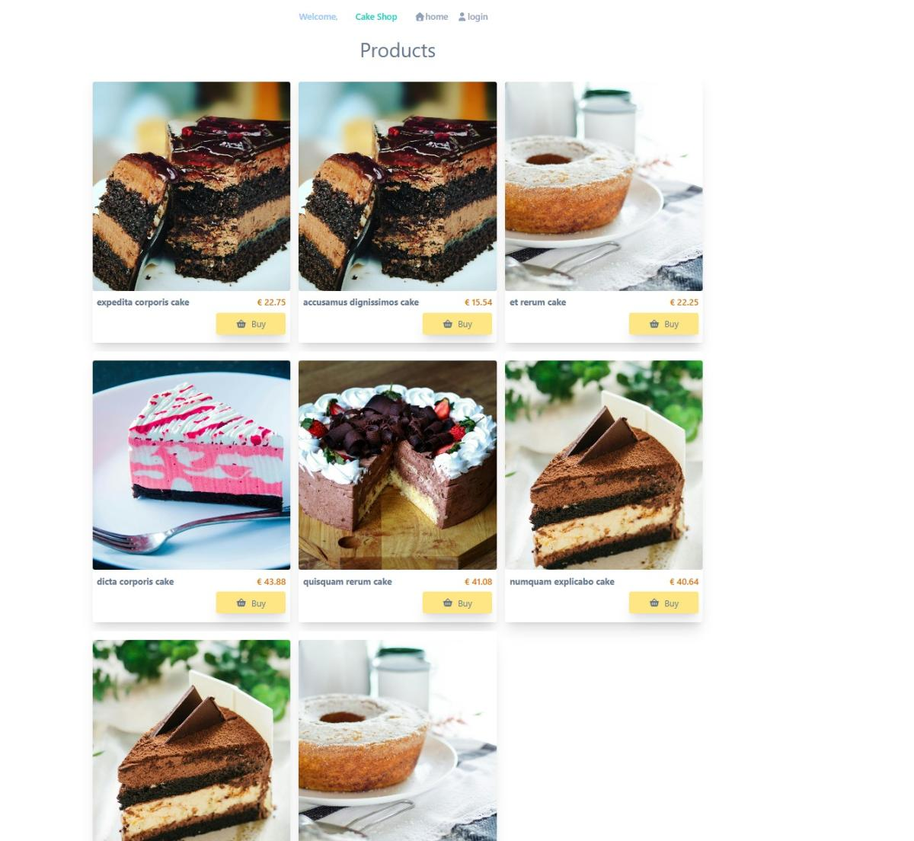

This repository is a work in progress and is just a simple project of my to become better in Laravel. This will be a simple website cake shop which does not make use of blade (SSR) but instead uses a frontend vue.js

Credits:

* Foto door Abhinav Goswami: https://www.pexels.com/nl-nl/foto/gesneden-cake-op-plaat-291528/
* Foto door Elli: https://www.pexels.com/nl-nl/foto/snijd-de-cake-1854652/
* Foto door ERIC MUFASA: https://www.pexels.com/nl-nl/foto/witte-en-roze-glazuur-bedekt-cake-gesneden-op-witte-plaat-met-zilverkleurige-vork-1414234/
* Foto door Ronmar Lacamiento: https://www.pexels.com/nl-nl/foto/close-up-fotografie-van-gesneden-cake-806363/
* Foto door Daniela  Echavez: https://www.pexels.com/nl-nl/foto/ondiepe-focusfotografie-van-cake-met-aardbei-bovenop-1120970/
* Foto door Isabella Mendes: https://www.pexels.com/nl-nl/foto/donut-op-witte-keramische-plaat-940838/
* Foto door Quang Nguyen Vinh: https://www.pexels.com/nl-nl/foto/foto-van-chocoladetaart-2144200/
* Foto door Igor Ovsyannykov: https://www.pexels.com/nl-nl/foto/donuts-en-bagel-display-205961/
* Foto door Lisa from Pexels: https://www.pexels.com/nl-nl/foto/koffiebar-1995010/

TODO:

* feature tests & unit tests & frontend tests
* Linter for ts & improve vue code where needed
* update readme
